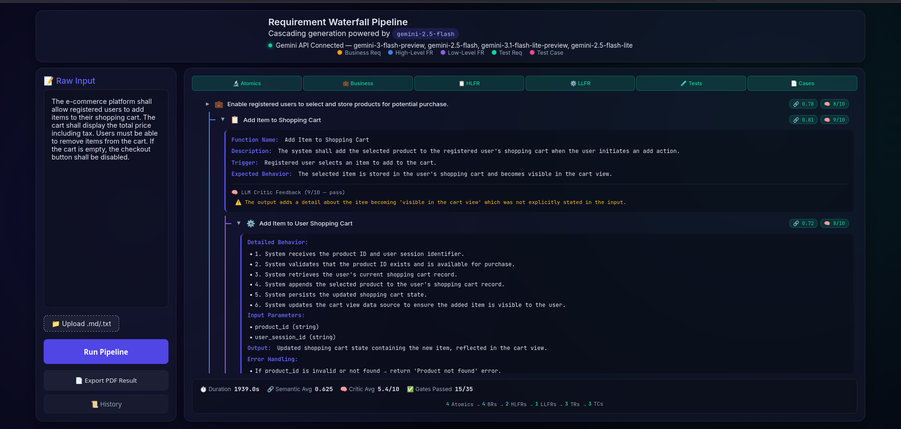

# ReqCascade

A cascading requirement decomposition system that transforms raw software requirements into structured, validated test cases using a multi-stage LLM pipeline with dual-gate quality validation.



## 🏗️ Architecture

```
Raw Text → Atomics → Business Reqs → HLFRs → LLFRs → Test Reqs → Test Cases
                  ↕ Gate A (Semantic)   ↕ Gate B (LLM Critic)
```

**Pipeline Stages:**
1. **Atomic Decomposition** — Splits raw input into independent requirement atoms
2. **Business Requirements** — Converts atomics into structured business rules
3. **High-Level Functional Requirements (HLFRs)** — Derives functional specifications
4. **Low-Level Functional Requirements (LLFRs)** — Detailed implementation-level requirements
5. **Test Requirements** — Defines test objectives and conditions
6. **Test Cases** — Generates step-by-step test procedures

**Dual-Gate Validation:**
- **Gate A** — Semantic cosine similarity (local, instant) ensures traceability
- **Gate B** — LLM critic scoring (1-10) validates completeness and correctness

## 🚀 Quick Start

### Prerequisites
- Docker & Docker Compose
- API keys for [DeepSeek](https://platform.deepseek.com) and/or [Google Gemini](https://aistudio.google.com/apikey)

### Setup

1. **Clone the repository:**
   ```bash
   git clone <your-repo-url>
   cd ReqCascade
   ```

2. **Configure API keys:**
   ```bash
   cp .env.example .env
   # Edit .env and add your actual API keys
   ```

3. **Run with Docker:**
   ```bash
   docker compose up --build
   ```

4. **Open the UI:**
   Navigate to [http://localhost:8000](http://localhost:8000)

### Run Without Docker

```bash
# Create virtual environment
python -m venv .venv
source .venv/bin/activate

# Install dependencies
pip install -r backend/requirements.txt

# Set environment variables (or use .env)
export DEEPSEEK_API_KEY_1=sk-your-key
export GEMINI_API_KEY_1=AIzaSy-your-key

# Start the server
cd backend
uvicorn main:app --host 0.0.0.0 --port 8000 --reload
```

## 📁 Project Structure

```
├── backend/
│   ├── main.py              # FastAPI server & API endpoints
│   ├── orchestrator.py      # Pipeline orchestration & stage management
│   ├── prompts.py           # LLM prompt templates for each stage
│   ├── gemini_client.py     # Multi-provider LLM client (Gemini + DeepSeek)
│   ├── deepseek_client.py   # Standalone DeepSeek client (fallback)
│   ├── ollama_client.py     # Ollama local model client
│   ├── validator.py         # Semantic similarity validator (Gate A)
│   ├── models.py            # Pydantic request/response models
│   └── requirements.txt     # Python dependencies
├── frontend/
│   ├── index.html           # Main UI page
│   ├── app.js               # Frontend application logic
│   └── styles.css           # UI styling
├── data/
│   └── history/             # Pipeline run history (auto-generated)
├── docs/
│   └── paper/               # IEEE-format research paper (LaTeX source + figures)
├── Dockerfile               # Container build configuration
├── docker-compose.yml       # Service orchestration
├── .env.example             # Environment variable template
└── .gitignore
```

## ⚙️ Multi-Provider LLM Strategy

The system uses **7 API slots** across 2 providers with interleaved round-robin rotation:

| Slot | Provider | Primary Model | Fallback Models |
|------|----------|---------------|-----------------|
| 0, 2, 4 | DeepSeek | `deepseek-chat` (V3) | `deepseek-reasoner` (R1) |
| 1, 3, 5, 6 | Gemini | `gemini-2.5-flash` | `gemini-3-flash-preview`, `gemini-2.5-flash-lite` |

- Zero-sleep on rate limits — instantly skips to next slot
- All 7 slots can run in parallel via semaphore
- Automatic model fallback per provider

## 📡 API Endpoints

| Method | Endpoint | Description |
|--------|----------|-------------|
| `GET` | `/api/health` | Health check with API connectivity status |
| `GET` | `/api/models` | List available LLM models |
| `POST` | `/api/run` | Run pipeline (SSE stream) |
| `POST` | `/api/run-with-file` | Run pipeline with file upload |
| `POST` | `/api/expand` | Expand a pruned node on-demand |
| `GET` | `/api/history` | List past pipeline runs |
| `GET` | `/api/history/{id}` | Fetch a specific run |
| `GET` | `/api/history/{id}/export-json` | Download run as JSON |

## 📄 License

This project is provided as-is for educational and research purposes.
